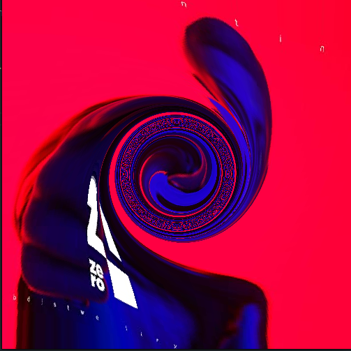

# Swirl Effect using SDL and C

This repository contains an implementation of the Swirl Effect using SDL (Simple DirectMedia Layer) and C. The program provides a simple interface in the terminal for displaying photos with the Swirl Effect applied.

## Project Structure

The project repository is organized as follows:

- **src:** Contains the source code files written in C, including the main program file and other supporting files.
- **include:** Contains the header files required for the project.
- **Makefile:** A file that automates the compilation process and generates the executable.

## Dependencies

To run the Swirl Effect program, you need to have the following dependencies installed on your system:

- SDL library: You can install the SDL library using your system's package manager or by following the installation instructions provided by the SDL project.

## Usage

To build and run the Swirl Effect program, follow these steps:

1. Clone this repository to your local machine using the following command:
```
git clone https://github.com/mikorozek/NASM-Swirl.git
```
2. Navigate the root directory of repository:
```
cd NASM-Swirl
```
3. Build the program using provided Makefile:
```
make
```
4. Run the program with the following command:
```
./swirl <filepath_to_bmp> <swirl_factor>
```
For the best experience I'd recommend to use swirl factor value greater or equal than -0.1 and lesser or equal than -0.003, because of implementation.
After running the program, the terminal interface will display the image with the Swirl Effect applied. You can adjust the `<swirl_factor>` parameter to control the intensity of the effect.
## Example Image

## License

This project is licensed under the [MIT License](LICENSE). Feel free to use and modify the code according to your needs.
